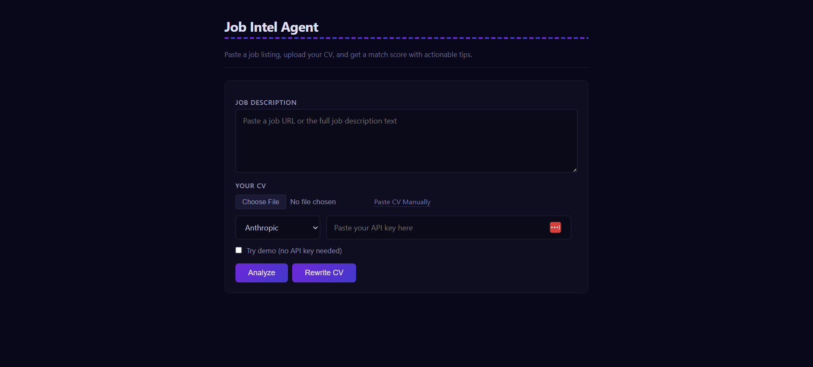
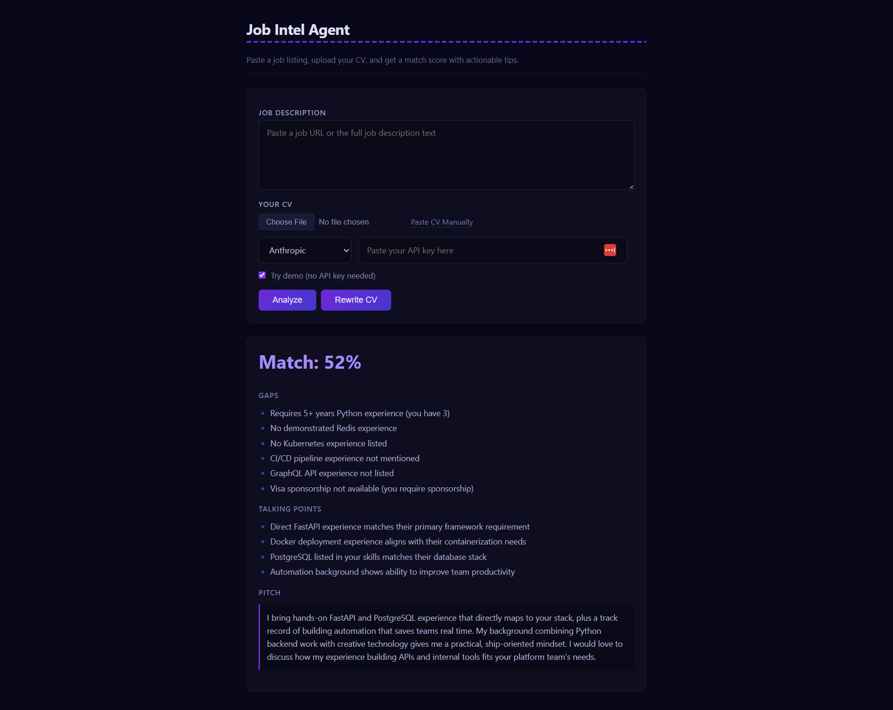
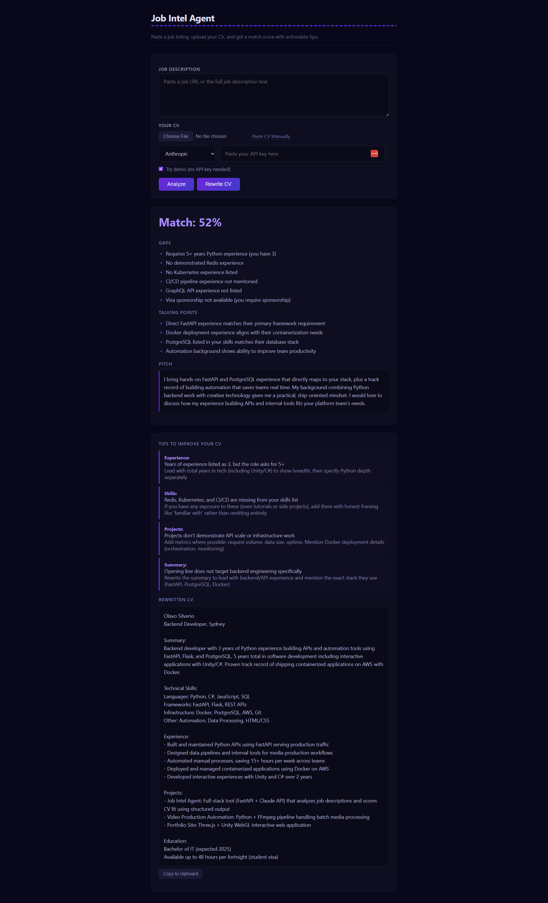

# Job Intel Agent

**Live demo:** [https://web-production-f7c5.up.railway.app](https://web-production-f7c5.up.railway.app)

Paste a job posting URL or raw text, upload your CV, and get back a structured match report: score, skill gaps, talking points, and a tailored pitch. Optionally, hit "Rewrite CV" to get section-by-section improvement tips and a rewritten version optimized for that specific role.

Built with FastAPI, Claude API (Anthropic) and GPT-4o-mini (OpenAI), Pydantic structured output, and a single-page vanilla JS frontend. No frameworks, no templates, no boilerplate generators.

---

## Why This Exists

Every job seeker does the same manual work: read a listing, compare it to their resume, guess where the gaps are. This tool automates that entire loop in seconds. It also doubles as a portfolio piece that demonstrates real AI engineering (structured output, tool_use, multi-provider support) rather than a ChatGPT wrapper.

## What It Does

1. **Analyze** a job listing (URL or pasted text) against your CV
   - Extracts structured data: required skills, nice-to-haves, seniority signals, red flags
   - Scores your CV fit (0-100%) with a ranked gap list
   - Generates talking points and a 3-sentence pitch tailored to the role

2. **Rewrite** your CV for a specific role
   - Returns section-by-section tips (what is wrong, how to fix it)
   - Generates a full rewritten CV optimized for the job description
   - One-click copy to clipboard

3. **Demo mode** works with zero API keys so anyone can try the full flow immediately

## Tech Stack

| Layer | Tech |
|-------|------|
| Backend | Python 3.11+, FastAPI, uvicorn |
| AI | Anthropic SDK (claude-3-5-haiku), OpenAI SDK (gpt-4o-mini) |
| Structured Output | Pydantic models + tool_use (Anthropic) / function calling (OpenAI) |
| Scraping | httpx + regex HTML stripping |
| Frontend | Vanilla HTML/CSS/JS, dark theme, no framework |
| Deploy | Railway (nixpacks) |
| Tests | pytest + pytest-asyncio, mocked API calls |

## Local Setup

```bash
git clone https://github.com/olavoshew/job-intel-agent.git
cd job-intel-agent
pip install -e .
cp .env.example .env
# Add your ANTHROPIC_API_KEY or OPENAI_API_KEY to .env
uvicorn src.main:app --reload
```

Open http://localhost:8000/static/index.html

## Demo Mode

Check "Try demo (no API key needed)" in the UI. Returns pre-scored results using hard-coded sample data so you can see the full flow instantly.

## Project Structure

```
src/
  main.py        FastAPI app, routes (/analyze, /rewrite)
  agent.py       LLM calls with structured output (Anthropic + OpenAI)
  schemas.py     Pydantic models: JobDescription, CVScore, CVTip, CVRewrite
  scraper.py     URL fetcher, HTML text extraction
  demo.py        Hard-coded demo data for zero-key testing
  cv.txt         Default candidate CV
static/
  index.html     Dark-themed single-page UI
  app.js         Vanilla JS form handling + rendering
  favicon.svg    Browser icon
tests/
  test_schemas.py   Pydantic validation (7 tests)
  test_agent.py     Mocked LLM calls (5 tests)
```

## Screenshots




